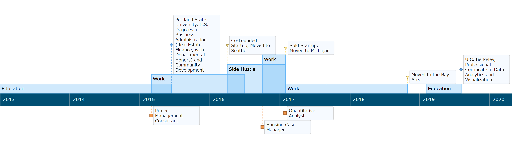
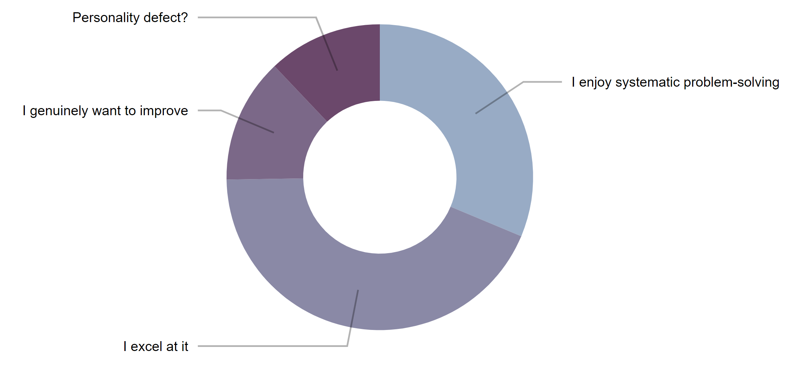

They say a picture is worth a thousand words, but this visualization encapsulates many of the ups and downs of the last several years---which I'd be hard-pressed to synthesize into such a brief summary. That last sentence was practically a thousand words, sheesh!

{:.lead data-width="800" data-height="300"}
My path to this point has been nonlinear, to say the least | [Code](https://gist.github.com/nickmccarty/770777de95aacc456fa4860864a9e955)
{:.figure}

After looking back at where I've been, it still amazes me that I am in the Bay Area in 2019 positioned to enter the analytics space. Having just completed UC Berkeley's Data Analytics and Visualization Bootcamp, I feel a sense of optimism and joy that reminds me of growing up in the real California (SoCal). I'm kidding! It really is an honor to be where I am now, and I am grateful for all of the bright, wonderful people I've had the privilege of working with since I've been here.

## Why Data Analysis Though?

Off the top of my head, I can think of several reasons:

{:.lead data-width="800" data-height="100"}
As cliche as it may sound, it's as though I was built for this | [Code](https://gist.github.com/nickmccarty/9dfe958d700dbb83b5d43c887188ec7a)
{:.figure}

The fact is that I bring with me a level of acumen that would very likely be of benefit to your project, team, and/or company. So why not reach out and start a conversation?

### Contact me

[NumerateAnalytics@gmail.com](mailto:NumerateAnalytics@gmail.com)
